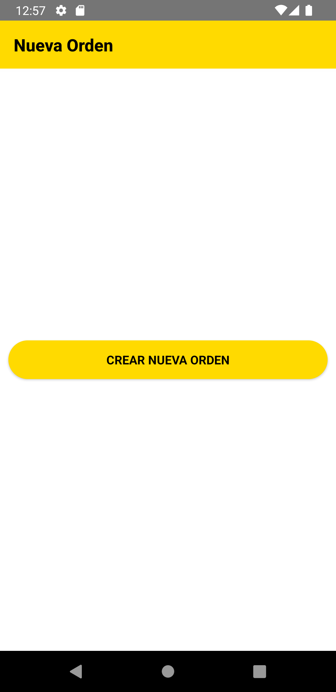
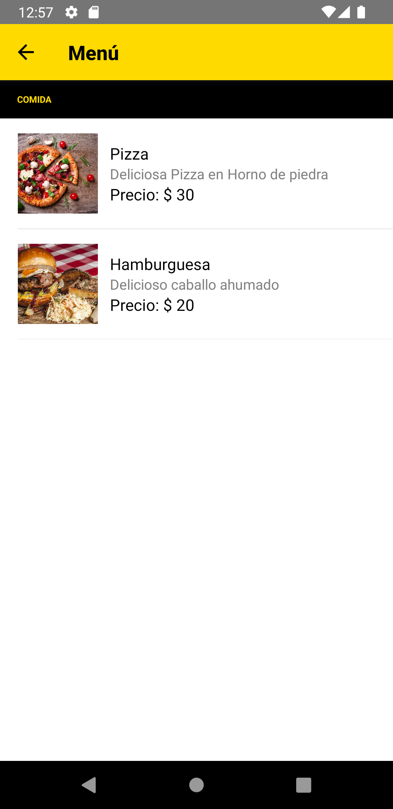
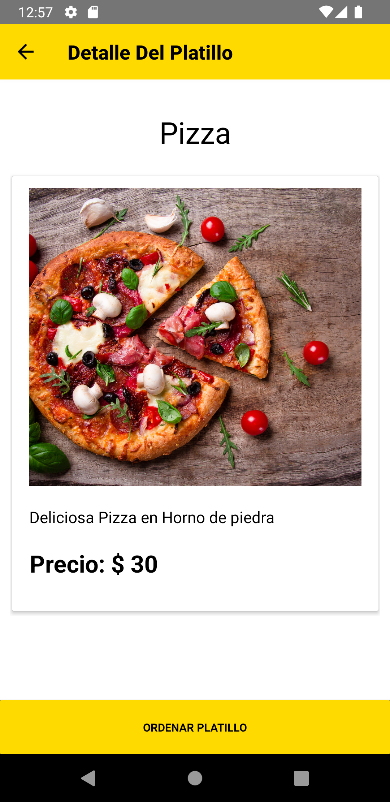
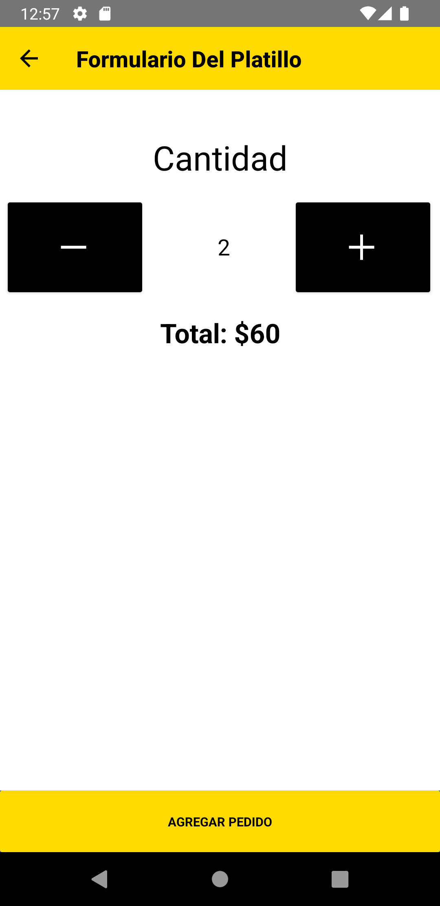
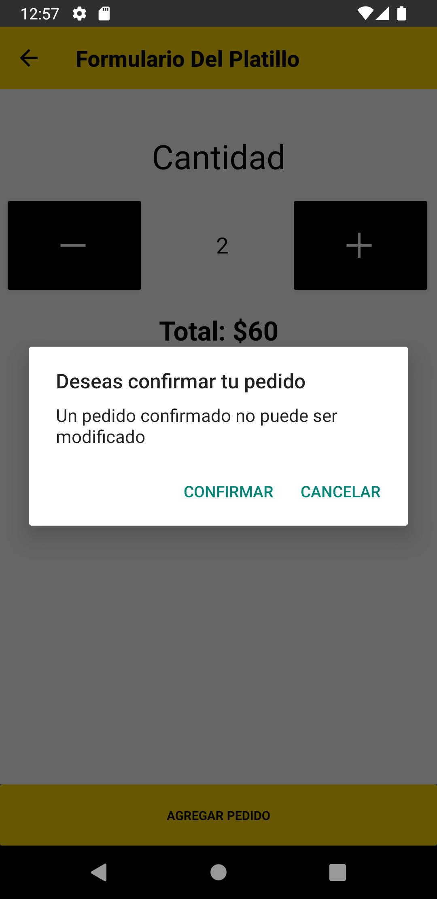
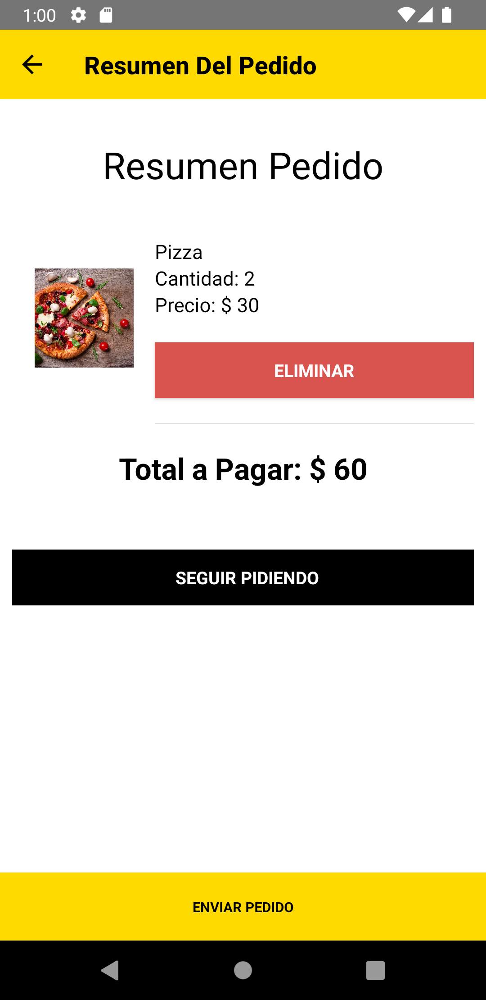
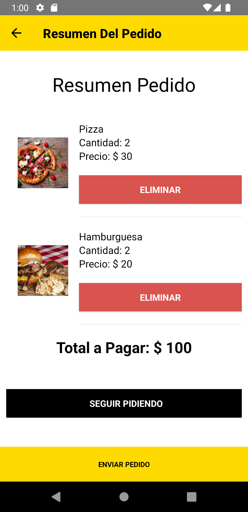
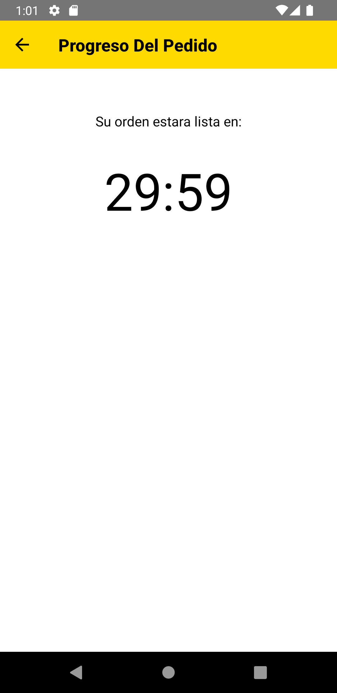

# restaurantapp
React-Native Project that works within a React application [restaurantecliente](<https://github.com/Jare9716/reastaurantecliente.git>) 
to automate the process of meal requesting the dishes to the server working with Firebase Database

# Libraries

This project has the next libraryes:

1. react-native-masked-view/masked-view
2. react-navigation/native
3. react-navigation/stack
4. deprecated-react-native-prop-types
5. firebase
6. react-countdown
7. react-native-vector-icons
8. native-base "2.15.2"

***Don't forget to install all the libraries and dependencies to run the project***

# Images

 &nbsp;&nbsp;&nbsp;&nbsp;
 &nbsp;&nbsp;&nbsp;&nbsp;
 &nbsp;&nbsp;&nbsp;&nbsp;

 &nbsp;&nbsp;&nbsp;&nbsp;
 &nbsp;&nbsp;&nbsp;&nbsp;
 &nbsp;&nbsp;&nbsp;&nbsp;

 &nbsp;&nbsp;&nbsp;&nbsp;
 &nbsp;&nbsp;&nbsp;&nbsp;
 &nbsp;&nbsp;&nbsp;&nbsp;

 &nbsp;&nbsp;&nbsp;&nbsp;
  
# Notes

* This project works only with the library `native-base 2` version, so is necessary to install the `deprecated-react-native-prop-types` library 

# Youtube Video

<https://youtu.be/F80a9BJFGKg>
